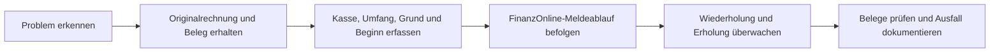

# 🚨 Ausfälle, DEP7 & Außerbetriebnahme

[🇬🇧 English](Outages-Exports-and-Decommissioning) · [🇩🇪 Deutsch](Ausfaelle-DEP7-Ausserbetriebnahme) · [Startseite](Startseite-Deutsch)

## Ablauf bei einem Ausfall

1. Bewahren Sie die ursprüngliche POS-Rechnung und den Fiskalbelegdatensatz. Keine Ersatzrechnung mit neuer Fiskalidentität für eine wartende Anfrage anlegen.
2. Erfassen Sie Beginn, betroffene Kasse und ob Fiskaly/Sicherheitssystem oder die Registrierkasse betroffen ist.
3. Prüfen Sie **Receipt Status**, **Fiscal Receipts**, **Cash Registers** und **Cash Register and Outage Lifecycle** und verwenden Sie die dort angebotenen Lebenszyklusaktionen.
4. Befolgen Sie den FinanzOnline-Meldeablauf Ihres Unternehmens. Die App führt Ausfallstatus, 48-Stunden-Schwelle, Meldestatus und Nachweisreferenzen; die Verantwortung für erforderliche Meldungen bleibt beim Betreiber.
5. Überwachen Sie nach Wiederherstellung Wiederholungen und automatische Belege. Prüfen Sie, dass betroffene Belege synchronisiert und keine Maßnahmen offen sind. Eskalieren Sie ungelöste Fehler, statt Datensätze direkt in der Datenbank zu ändern.

> 🧪 Wiederherstellung nur in einer freigegebenen TEST-Umgebung simulieren. Keine Ausfälle an LIVE-Kassen erzeugen.

## Jahresbeleg nachverfolgen

- Prüfen Sie regelmäßig **Fiskaly Receipt Status**, einschließlich automatischer Monats-, Jahres-, Wiederherstellungs- und Schlussbelege, sofern vorhanden.
- Beachten Sie beim Jahresbeleg die Prüfungsfrist der App und erfassen Sie Prüfergebnis sowie Nachweis direkt am Beleg.
- Bei `ACTION_REQUIRED`, fehlgeschlagener FinanzOnline-Prüfung oder überschrittener Prüffrist weisen Sie die Bearbeitung dem zuständigen Administrator bzw. der Buchhaltung zu und dokumentieren die Lösung.

## DEP7-Export erstellen und archivieren

Öffnen Sie **Fiskaly RKSV → DEP7 Exports**.

| Schritt | Aktion |
| --- | --- |
| 1 | Erstellen Sie einen Export für die richtige Kasse. Wählen Sie Zweck (z. B. Quartalssicherung oder Prüfung) sowie Umfang/Zeitraum. |
| 2 | Warten Sie auf Status **READY**. Prüfen Sie bei **FAILED** oder **ACTION_REQUIRED** die Begründung und eskalieren Sie bei Bedarf. |
| 3 | Laden Sie DEP7-Datei und – sofern vorhanden – Ergänzungsdatei herunter. Bewahren Sie beide gemeinsam auf. |
| 4 | Starten Sie die Integritätsprüfung und gleichen Sie jede Datei mit dem gespeicherten SHA-256-Wert ab. |
| 5 | Kopieren Sie beide Dateien in das freigegebene externe Archiv, getrennt vom ERPNext-Server. |
| 6 | Erfassen Sie die Speicherreferenz und bestätigen Sie die externe Kopie. Beachten Sie Aufbewahrungsdatum und betriebliche Aufbewahrungsregeln. |

DEP7-Dateien, produktive Belegdaten, Provider-Download-Links und Kundendaten gehören nicht in dieses öffentliche Wiki oder öffentliche Issue-Anhänge.

## Kasse außer Betrieb nehmen

Starten Sie den Ablauf nur, wenn die Kasse dauerhaft geschlossen wird. Bearbeiten Sie zuerst offene Fiskalbelege und Ausfälle.

1. Schließen Sie die Kasse und erstellen Sie den Schlussbeleg.
2. Prüfen und archivieren Sie das PDF des Schlussbelegs privat.
3. Erstellen Sie den vollständigen finalen DEP7-Export samt Ergänzungsdatei.
4. Prüfen Sie beide SHA-256-Werte.
5. Kopieren Sie beide Dateien extern und erfassen Sie die Speicherreferenz.
6. Schließen Sie die Außerbetriebnahme erst ab, wenn alle Nachweise geprüft sind.

Nehmen Sie keine SCU außer Betrieb, die noch von einer aktiven Kasse verwendet wird. Bewahren Sie Schlussbeleg, Exporte, Prüfnachweise und Bestätigung der externen Kopie gemäß Aufbewahrungsfrist auf.

## Fehlerbehebung · erste Prüfungen

| Problem | Erste Prüfungen |
| --- | --- |
| Verbindungstest schlägt fehl | Provider, Unternehmen, TEST/LIVE-Umgebung, Zugangsdaten, Netzwerk und abweichenden Endpunkt prüfen. Vor dem Test speichern. |
| FinanzOnline-Authentifizierung schlägt fehl | Umgebung kontrollieren. TEST verwendet Dummywerte; LIVE die freigegebenen echten Webservice-Benutzerdaten. Zugangsdaten nicht in Tickets oder Logs kopieren. |
| Beleg bleibt wartend/in Wiederholung | Originalrechnung erhalten. **Receipt Status**, nächsten Versuch und verknüpftes API-Protokoll prüfen. Bei fehlender Erholung oder erforderlicher Aktion eskalieren. |
| Beleg hat `ACTION_REQUIRED` | Fehler prüfen und Fiskaly-Administrator Verbindung, USt-Mapping, Providerstatus und Lebenszyklusdatensätze kontrollieren lassen. Nutzdaten des Belegs nicht ändern. |
| QR-Code oder Druck fehlt | Druckformat **POS Invoice RKSV** am POS-Profil prüfen und geschützte Druckaktion verwenden. Keine neue Rechnung als Druckumgehung erstellen. |
| DEP7-Export wird nicht fertig | Status, letzten Fehler, Abrufversuche und Provider-Verbindung prüfen. Nur dann über den Exportablauf erneut versuchen, wenn die App diese Aktion anbietet. |

API-Protokolle sind für die Fehlersuche redigiert, können aber weiterhin Betriebsinformationen enthalten. Teilen Sie sie nach Prüfung nur über freigegebene private Supportkanäle.

