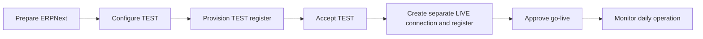

# 🇦🇹 ERPNext Fiskaly SIGN AT

### Operations handbook · Austria · Frappe / ERPNext 16

**Language:** 🇬🇧 English · [🇩🇪 Deutsch](Startseite-Deutsch)

> ⚠️ **Public documentation:** This repository and its Wiki are public. Never publish API credentials, FinanzOnline credentials, customer or receipt data, production identifiers, or screenshots containing confidential information.

## Choose a guide

| If you are… | Start here | You will learn to… |
| --- | --- | --- |
| a Fiskaly administrator | [Administrator Guide](Administrator-Guide) | Configure TEST, provision registers, accept the setup, and prepare LIVE. |
| a POS cashier | [POS Operations](POS-Operations) | Open a shift, complete sales, print receipts, process returns, and close the shift. |
| a POS manager or accountant | [POS Operations](POS-Operations) and [Outages, Exports & Decommissioning](Outages-Exports-and-Decommissioning) | Monitor exceptions, preserve evidence, create DEP7 exports, and close a register safely. |

## Recommended rollout

## Operating guardrails

- **TEST first:** Complete and document a controlled TEST run before preparing LIVE.
- **Keep environments separate:** Use separate credentials, connections, and registers for TEST and LIVE.
- **Production path:** SIGN AT v1 supports production operation in the app. SIGN AT Unified is TEST-only; LIVE is disabled.
- **Protect fiscal records:** Do not edit receipt signatures, QR data, identifiers, provider snapshots, or lifecycle records manually.
- **Escalate exceptions:** Keep the original invoice and receipt identity; do not create replacement sales to work around pending requests.

## Need help?

In ERPNext, open the **Fiskaly RKSV**, **POS Manager**, or **POS Cashier** workspace. Their built-in help pages contain guidance for the installed app version and shortcuts to the related records.

This handbook describes operational workflows. It is not tax or legal advice; have the responsible accounting or tax adviser confirm company-specific settings and procedures.

