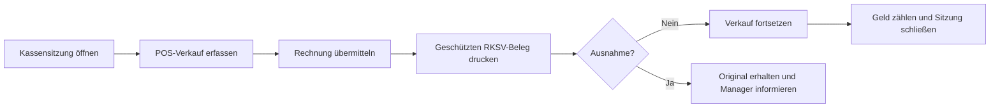

# 🧾 Kassenbetrieb

[🇬🇧 English](POS-Operations) · [🇩🇪 Deutsch](Kassenbetrieb) · [Startseite](Startseite-Deutsch)

Beachten Sie zusätzlich die internen Regeln zum Umgang mit Bargeld.

## Ablauf für Kassierer:innen

### 1 · Schicht beginnen

1. Öffnen Sie **POS Cashier → Open POS** (POS Opening Entry).
2. Wählen Sie das zugewiesene POS-Profil und tragen Sie den tatsächlichen Anfangsbestand ein.
3. Übermitteln Sie vor dem ersten Verkauf genau eine Eröffnung. Legen Sie keine weitere an, solange Ihre Sitzung offen ist.
4. Öffnen Sie **Point of Sale** mit demselben POS-Profil.

### 2 · Verkauf abschließen

1. Fügen Sie Artikel hinzu und prüfen Sie Mengen, Kunde und steuerliche Behandlung.
2. Wählen Sie die richtige Zahlungsart. Bei Mischzahlungen muss die Summe der Teilbeträge dem Rechnungsbetrag entsprechen.
3. Übermitteln Sie die Rechnung über den Point of Sale. Erfassen Sie Barverkäufe nicht über einen davon unabhängigen Nicht-POS-Ablauf.
4. Drucken Sie den Fiskalbeleg über die geschützte RKSV-Druckaktion. Prüfen Sie Lesbarkeit und QR-Code, bevor Sie den Beleg übergeben.
5. Ist der Beleg wartend, in Wiederholung, fehlgeschlagen oder maßnahmenpflichtig, erstellen Sie keine Ersatzrechnung und ändern Sie keine Fiskalfelder. Informieren Sie den POS-Manager und prüfen Sie **Receipt Status**.

Geben Sie dem Kunden den Originaldruck. Ein späterer Ausdruck muss über die kontrollierte Aktion erfolgen und wird als Duplikat markiert. Eine Desk-Vorschau ist kein Kundenbeleg.

### 3 · Retouren und Korrekturen

- Erfassen Sie Retouren über den freigegebenen ERPNext-POS-Retourenablauf mit Bezug zur Originalrechnung.
- Eine fiskalisierte Rechnung nicht direkt stornieren, löschen oder ändern.
- Fehlen Originalrechnung oder Fiskalbeleg, stoppen Sie und lassen Sie den POS-Manager den Vorgang prüfen.

### 4 · Schicht schließen

1. Öffnen Sie **POS Cashier → Close POS** (POS Closing Entry) und wählen Sie Ihre offene Sitzung.
2. Zählen Sie Bargeld und andere Zahlungsbeträge und tragen Sie die tatsächlichen Summen ein.
3. Vergleichen Sie die Zählung mit den erfassten Zahlungsarten und übermitteln Sie den Abschluss.
4. Ist ein Fiskalbeleg noch offen oder stimmen Beträge nicht, informieren Sie vor dem Abschluss den POS-Manager.

## POS-Manager · tägliche Prüfungen

| Workspace-Eintrag | Prüfen |
| --- | --- |
| POS Openings / POS Closings | Offene Sitzungen und Abweichungen zwischen Zählung und Buchung. |
| POS Invoices / Fiscal Receipts | Bezug zwischen Rechnung und Retoure sowie Status des Fiskalbelegs. |
| Receipt Status | Wartende, wiederholte, fehlgeschlagene oder maßnahmenpflichtige Belege. |
| POS Profiles / Modes of Payment | Benutzer, Lager, Preisliste, Zahlungsarten und RKSV-Klassifizierung. |

Stimmen Sie Änderungen an USt-Mappings, Kassen, Verbindungen und Umgebungen mit dem Fiskaly-Administrator ab. Signaturdaten und QR-Inhalte niemals manuell reparieren.

## Fiskalbeleg-Status · Kurzübersicht

| Status | Bedeutung und nächster Schritt |
| --- | --- |
| ✅ `SIGNED` | Provider hat einen signierten Beleg geliefert. Beleg prüfen und Drucknachweis wie vorgesehen aufbewahren. |
| ⏳ `OFFLINE_PENDING` / `RETRYING` | Synchronisierung oder Wiederholung steht aus. Originalrechnung erhalten und **Receipt Status** beobachten. |
| 🟠 `SUBSTITUTE_SIGNED` | Ersatz-/Offline-Signaturpfad wurde verwendet. Ausfall- und Wiederherstellungsablauf beachten. |
| 🚨 `ACTION_REQUIRED` | Prüfung durch eine zuständige Person erforderlich. Eskalieren; keinen Doppelverkauf erfassen. |
| 🔄 `PREPARED` / `SIGNING` | Verarbeitung läuft. Status aktualisieren und eskalieren, falls der Vorgang hängen bleibt oder einen Fehler meldet. |

