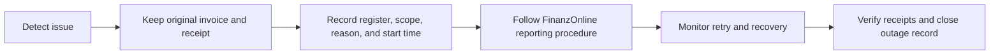

# 🚨 Outages, Exports & Decommissioning

[🇬🇧 English](Outages-Exports-and-Decommissioning) · [🇩🇪 Deutsch](Ausfaelle-DEP7-Ausserbetriebnahme) · [Home](Home)

## Outage workflow

1. Preserve the original POS invoice and fiscal receipt record. Never create a replacement invoice with a new fiscal identity to work around a pending request.
2. Record when the issue began, the affected register, and whether it concerns the Fiskaly/security system or the cash register.
3. Review **Receipt Status**, **Fiscal Receipts**, **Cash Registers**, and **Cash Register and Outage Lifecycle**; follow the available lifecycle actions.
4. Follow your organization’s FinanzOnline reporting procedure. The app tracks outage state, a 48-hour threshold, reporting status, and evidence references; the operator remains responsible for required reporting.
5. After service returns, monitor retries and automatic receipts. Confirm affected receipts are synchronized and no action-required items remain. Escalate unresolved errors; do not edit records in the database.

> 🧪 Test recovery only in an approved TEST environment. Never simulate an outage on LIVE.

## Year-end receipt follow-up

- Review **Fiskaly Receipt Status** regularly, including automatic monthly, yearly, recovery, and closing receipts where applicable.
- For a yearly receipt, follow the app’s verification deadline and record the verification result and evidence on the receipt.
- If a receipt has `ACTION_REQUIRED`, failed FinanzOnline validation, or overdue verification, assign it to the responsible administrator/accounting contact and document the resolution.

## Create and archive a DEP7 export

Open **Fiskaly RKSV → DEP7 Exports**.

| Step | Action |
| --- | --- |
| 1 | Create an export for the correct register. Select the purpose (for example, quarterly backup or audit) and required scope/date range. |
| 2 | Wait for status **READY**. For **FAILED** or **ACTION_REQUIRED**, review the reason and escalate when needed. |
| 3 | Download the DEP7 file and supplementary file, when provided. Keep them together. |
| 4 | Run integrity verification and confirm each file matches its recorded SHA-256 value. |
| 5 | Copy both files to the organization’s approved external archive, separate from the ERPNext server. |
| 6 | Record the external storage reference and confirm the external copy. Respect the retention date and company retention policy. |

Never place DEP7 files, production records, provider download links, or customer data in this public Wiki or in public issue attachments.

## Decommission a register

Start only when the register is permanently closing. Resolve open receipts and outages first.

1. Close the register and create the closing receipt.
2. Verify and privately archive the closing receipt PDF.
3. Create the final complete DEP7 export and supplementary file.
4. Verify both SHA-256 hashes.
5. Copy both files to external storage and record the storage reference.
6. Complete the final decommission step only after all evidence checks pass.

Do not decommission an SCU still used by another active register. Retain the closing receipt, exports, verification, and external-copy evidence for the applicable retention period.

## Troubleshooting · First checks

| Symptom | First checks |
| --- | --- |
| Connection test fails | Confirm provider, company, TEST/LIVE environment, credential pair, network access, and any configured endpoint. Save before testing. |
| FinanzOnline authentication fails | Confirm environment. TEST uses dummy values; LIVE uses the authorized real web-service user details. Keep credentials out of tickets and logs. |
| Receipt stays pending/retrying | Keep the original invoice. Review **Receipt Status**, next retry, and the linked API log. Escalate if it does not recover or needs action. |
| Receipt is `ACTION_REQUIRED` | Review the recorded error and ask the Fiskaly administrator to check the connection, VAT mapping, provider state, and lifecycle records. Do not change the receipt payload. |
| QR code or print is missing | Check the POS Profile’s **POS Invoice RKSV** print format and use the protected print action. Do not create another invoice as a printing workaround. |
| DEP7 export is not ready | Check status, last error, polling attempts, and provider connection. Retry through the export workflow only if the app offers that action. |

API logs are intended for troubleshooting and are redacted, but can still contain operational context. Share them only through approved private support channels after review.

