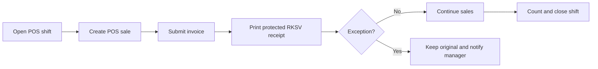

# 🧾 POS Operations

[🇬🇧 English](POS-Operations) · [🇩🇪 Deutsch](Kassenbetrieb) · [Home](Home)

Follow these steps alongside your organization’s cash-handling procedures.

## Cashier workflow

### 1 · Start a shift

1. Open **POS Cashier → Open POS** (POS Opening Entry).
2. Select your assigned POS Profile and enter the actual opening cash balance.
3. Submit one opening entry before the first sale. Do not create another while your session is open.
4. Open **Point of Sale** using the same POS Profile.

### 2 · Complete a sale

1. Add items and confirm quantities, customer, and tax treatment.
2. Select the correct payment method. For mixed payments, enter each amount accurately and make sure the total equals the invoice total.
3. Submit the invoice through Point of Sale. Do not record a cash sale through an unrelated non-POS workflow.
4. Print the fiscal receipt using the app’s protected RKSV print action. Check that the receipt and QR code are legible before handing it to the customer.
5. If the receipt is pending, retrying, failed, or requires action, do not create a replacement invoice or edit fiscal fields. Notify the POS Manager and check **Receipt Status**.

Use the original print for the customer. Print a later copy only through the controlled action; copies are marked as duplicates. Desk previews are not a customer receipt.

### 3 · Returns and corrections

- Create a return through the approved ERPNext POS return workflow and reference the original invoice.
- Do not directly cancel, delete, or edit a fiscalized invoice to reverse a sale.
- If the original invoice or receipt cannot be found, stop and ask the POS Manager to investigate.

### 4 · Close a shift

1. Open **POS Cashier → Close POS** (POS Closing Entry) and select your open session.
2. Count the actual cash and other payment totals and enter them accurately.
3. Compare counted amounts with recorded payment methods, then submit the closing entry.
4. If a fiscal receipt is pending or the totals do not match, contact the POS Manager before closing.

## POS Manager · Daily checks

| Workspace item | Review |
| --- | --- |
| POS Openings / POS Closings | Sessions left open and differences between counted and recorded amounts. |
| POS Invoices / Fiscal Receipts | Invoice and return relationships, plus linked receipt status. |
| Receipt Status | Pending, retrying, failed, and action-required receipts. |
| POS Profiles / Modes of Payment | Users, warehouse, price list, payment methods, and RKSV classification. |

Coordinate tax mapping, register, connection, and environment changes with the Fiskaly administrator. Never repair signature data or QR content manually.

## Receipt status · Quick reference

| State | Meaning and next step |
| --- | --- |
| ✅ `SIGNED` | Provider returned a signed receipt. Check it and retain print evidence as required. |
| ⏳ `OFFLINE_PENDING` / `RETRYING` | Synchronization or retry is pending. Preserve the original invoice and monitor **Receipt Status**. |
| 🟠 `SUBSTITUTE_SIGNED` | A substitute/offline signing path was used. Follow the outage and recovery procedure. |
| 🚨 `ACTION_REQUIRED` | Investigation is needed. Escalate; do not create a duplicate sale. |
| 🔄 `PREPARED` / `SIGNING` | Processing is underway. Refresh the status and escalate if it remains stuck or reports an error. |

