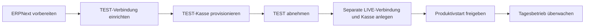

# 🇦🇹 ERPNext Fiskaly SIGN AT

### Betriebsanleitung · Österreich · Frappe / ERPNext 16

**Sprache:** [🇬🇧 English](Home) · 🇩🇪 Deutsch

> ⚠️ **Öffentliche Dokumentation:** Dieses Repository und sein Wiki sind öffentlich. Veröffentliche hier niemals API-Zugangsdaten, FinanzOnline-Zugangsdaten, Kunden- oder Belegdaten, produktive Kennungen oder Screenshots mit vertraulichen Informationen.

## Passende Anleitung auswählen

| Wenn Sie … | Hier beginnen | Inhalt |
| --- | --- | --- |
| Fiskaly-Administrator sind | [Administrationshandbuch](Administrationshandbuch) | TEST einrichten, Kassen provisionieren, Tests abnehmen und LIVE vorbereiten. |
| an der Kasse arbeiten | [Kassenbetrieb](Kassenbetrieb) | Schicht öffnen, verkaufen, Belege drucken, Retouren erfassen und Schicht schließen. |
| POS-Manager oder Buchhaltung sind | [Kassenbetrieb](Kassenbetrieb) und [Ausfälle, DEP7 & Außerbetriebnahme](Ausfaelle-DEP7-Ausserbetriebnahme) | Ausnahmen überwachen, Nachweise sichern, DEP7 exportieren und Kassen sauber schließen. |

## Empfohlener Ablauf

## Grundregeln für den Betrieb

- **Zuerst TEST:** Testen und dokumentieren Sie den vollständigen Ablauf, bevor Sie LIVE vorbereiten.
- **Umgebungen trennen:** Verwenden Sie eigene Zugangsdaten, API-Verbindungen und Kassen für TEST und LIVE.
- **Produktivpfad:** SIGN AT v1 unterstützt den Produktivbetrieb in der App. SIGN AT Unified ist nur für TEST verfügbar; LIVE ist deaktiviert.
- **Fiskalbelege schützen:** Signaturen, QR-Daten, Kennungen, Provider-Snapshots und Lebenszyklusdaten nicht manuell ändern.
- **Ausnahmen eskalieren:** Originalrechnung und Belegidentität erhalten. Keine Ersatzverkäufe erzeugen, um wartende Anfragen zu umgehen.

## Hilfe in ERPNext

Öffnen Sie in ERPNext den Workspace **Fiskaly RKSV**, **POS Manager** oder **POS Cashier**. Die eingebauten Hilfeseiten enthalten Hinweise zur installierten App-Version und direkte Links zu den relevanten Datensätzen.

Diese Anleitung beschreibt die Bedienabläufe der App. Sie ersetzt keine steuerliche oder rechtliche Beratung. Lassen Sie unternehmensspezifische Einstellungen durch die zuständige Buchhaltung oder Steuerberatung prüfen.

